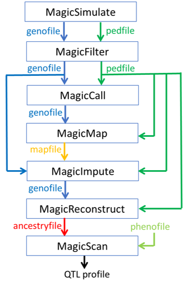

# RABBIT

**A statistical pipeline for genetic analysis in connected multiparental (diploid) populations**

## Features

- Functions include data filtering, map construction, genotype imputation, and haplotype reconstruction.
- Apply to many multiparental populations with shared inbred or outbred parents 
- Account for various sequencing errors such as allelic bias
- Efficient for genomic data with hundreds of thousands of markers

## License

The software is licensed under [PolyForm Strict License 1.0.0](https://polyformproject.org/licenses/strict/1.0.0). For commercial usage, a (paid) license agreement needs to be set up. To obtain the license agreement, contact <rabbit-support@wur.nl>.

## Document


See [RABBITManual](https://github.com/Biometris/RABBITManual) for the detailed online document.  

## Install 

1. Download and install Julia available at https://julialang.org/
2. Download RABBIT repository
3. In a command shell, run

```
path/to/bin/julia.exe path/to/install_RABBIT.jl
```

Alternatively, from the Julia (>v1.9, 64-bit) REPL model, run

 ```
 julia>include("path/to/install_RABBIT.jl")
 ```
 
 Similarly, use uninstall_RABBIT.jl to uninstall RABBIT, and use test_RABBIT.jl to test RABBIT. 

## Packages 



RABBIT consists of a set of Julia packages. Here is a list of key packages. 

| Package name     | Description |
|:-----------------|:----------- |
|`MagicBase`       | Basic data structures and functions |
|`MagicSimulate`   | Simulation of genotypic/phenotypic data |
|`MagicFilter`     | Filter genotypic data |
|`MagicCall`       | Single marker genotype calling |
|`MagicMap`        | Linkage map construction |
|`MagicImpute`     | Genotype imputation |
|`MagicReconstruct`| Haplotype reconstruction |
|`MagicScan`| QTL scan (EXPERIMENT) |

## Run RABBIT in Julia REPL

### Load package

To load a package for data analysis such as genotype imputatioin, run 

```julia
using MagicImpute
```

### Run function

Generally, RABBIT requires two inputs: genofile and pedinfo. The following is an overview of key functions. 

```julia
magicsimulate("founderhaplo.vcf.gz","ped.csv")
magicfilter("geno.vcf.gz","ped.csv")
magiccall("geno.vcf.gz","ped.csv")
magicmap("geno.vcf.gz","ped.csv")
magicimpute("geno.vcf.gz","ped.csv"; mapfile="outstem_magicmap_construct_map.csv.gz")
magicreconstruct("geno.vcf.gz","ped.csv")
```

### Help

To get help for a function such as `magicimpute`, run

```julia
?magicimpute
```


## Run RABBIT in a command line. 

The RABBIT CLI is a collection of main function files that are located in the download RABBIT repository folder `RABBIT/RABBITCLI`; each file is a wrapper of the corresponding julia function. 

### Run main function file

Change into work directory including input files, and run a main function file in a command shell, 

```
path/to/bin/julia.exe path/to/RABBITCLI/src/rabbit_function.jl -g geno.vcf.gz -p ped.csv
```

We will assume that the paths to julia.exe and the main function file have been added in the platform environmental variable `PATH`.

```
julia rabbit_function.jl -g geno.vcf.gz -p ped.csv
```

The following is an overview of the key main function files:

```
julia rabbit_magicfilter.jl -g geno.vcf.gz -p ped.csv
julia rabbit_magiccall.jl -g geno.vcf.gz -p ped.csv
julia rabbit_magicmap.jl -g geno.vcf.gz -p ped.csv
julia rabbit_magicimpute.jl -g geno.vcf.gz -p ped.csv --mapfile outstem_magicmap_construct_map.csv.gz
julia rabbit_magicreconstruct.jl -g geno.vcf.gz -p ped.csv
```

### Help

To get help for each main function file, run

```
julia rabbit_function.jl -h
```

